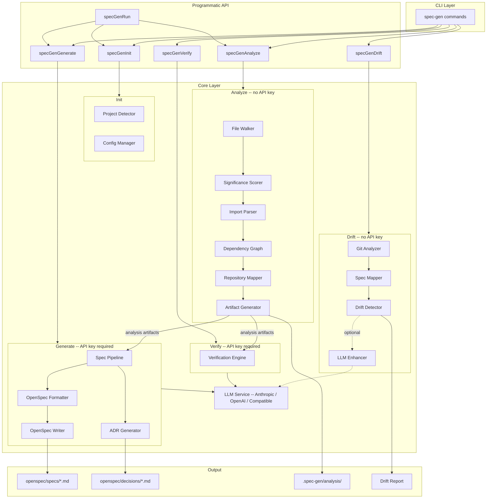

# spec-gen

Reverse-engineer [OpenSpec](https://github.com/Fission-AI/OpenSpec) specifications from existing codebases, then keep them in sync as code evolves.

## The Problem

Most software has no specification. The code is the spec, scattered across thousands of files, tribal knowledge, and stale documentation. Tools like `openspec init` create empty scaffolding, but someone still has to write everything. By the time specs are written manually, the code has already changed.

spec-gen automates this. It analyzes your codebase through static analysis, generates structured specifications using an LLM, and continuously detects when code and specs fall out of sync.

## Quick Start

```bash
# Install
git clone https://github.com/clay-good/spec-gen
cd spec-gen
npm install && npm run build && npm link

# Navigate to your project
cd /path/to/your-project

# Run the pipeline
spec-gen init       # Detect project type, create config
spec-gen analyze    # Static analysis (no API key needed)
spec-gen generate   # Generate specs (requires API key)
spec-gen drift      # Check for spec drift
```

<details>
<summary>Nix/NixOS</summary>

**Run directly:**

```bash
nix run github:clay-good/spec-gen -- init
nix run github:clay-good/spec-gen -- analyze
nix run github:clay-good/spec-gen -- generate
```

**Temporary shell:**

```bash
nix shell github:clay-good/spec-gen
spec-gen --version
```

**System flake integration:**

```nix
{
  inputs.spec-gen.url = "github:clay-good/spec-gen";

  outputs = { self, nixpkgs, spec-gen }: {
    nixosConfigurations.myhost = nixpkgs.lib.nixosSystem {
      modules = [{
        environment.systemPackages = [ spec-gen.packages.x86_64-linux.default ];
      }];
    };
  };
}
```

**Development:**

```bash
git clone https://github.com/clay-good/spec-gen
cd spec-gen
nix develop
npm run dev
```

</details>

## What It Does

**1. Analyze** (no API key needed)

Scans your codebase using pure static analysis:
- Walks the directory tree, respects .gitignore, scores files by significance
- Parses imports and exports to build a dependency graph
- Clusters related files into business domains automatically
- Produces structured context that makes LLM generation more accurate

**2. Generate** (API key required)

Sends the analysis context to an LLM to produce specifications:
- Stage 1: Project survey and categorization
- Stage 2: Entity extraction (core data models)
- Stage 3: Service analysis (business logic)
- Stage 4: API extraction (HTTP endpoints)
- Stage 5: Architecture synthesis (overall structure)
- Stage 6: ADR enrichment (Architecture Decision Records, with `--adr`)

**3. Verify** (API key required)

Tests generated specs by predicting file contents from specs alone, then comparing predictions to actual code. Reports an accuracy score and identifies gaps.

**4. Drift Detection** (no API key needed)

Compares git changes against spec file mappings to find divergence:
- **Gap**: Code changed but its spec was not updated
- **Stale**: Spec references deleted or renamed files
- **Uncovered**: New files with no matching spec domain
- **Orphaned**: Spec declares files that no longer exist
- **ADR gap**: Code changed in a domain referenced by an ADR
- **ADR orphaned**: ADR references domains that no longer exist in specs

## Architecture



## Drift Detection

Drift detection is the core of ongoing spec maintenance. It runs in milliseconds, needs no API key, and works entirely from git diffs and spec file mappings.

```bash
$ spec-gen drift

  Spec Drift Detection

  Analyzing git changes...
  Base ref: main
  Branch: feature/add-notifications
  Changed files: 12

  Loading spec mappings...
  Spec domains: 6
  Mapped source files: 34

  Detecting drift...

   Issues Found: 3

   [ERROR] gap: src/services/user-service.ts
      Spec: openspec/specs/user/spec.md
      File changed (+45/-12 lines) but spec was not updated

   [WARNING] uncovered: src/services/email-queue.ts
      New file has no matching spec domain

   [INFO] adr-gap: openspec/decisions/adr-0001-jwt-auth.md
      Code changed in domain(s) auth referenced by ADR-001

   Summary:
     Gaps: 2
     Uncovered: 1
     ADR gaps: 1
```

### ADR Drift Detection

When `openspec/decisions/` contains Architecture Decision Records, drift detection automatically checks whether code changes affect domains referenced by ADRs. ADR issues are reported at `info` severity since code changes rarely invalidate architectural decisions. Superseded and deprecated ADRs are excluded.

### LLM-Enhanced Mode

Static drift detection catches structural changes but cannot tell whether a change actually affects spec-documented behavior. A variable rename triggers the same alert as a genuine behavior change.

`--use-llm` post-processes gap issues by sending each file's diff and its matching spec to the LLM. The LLM classifies each gap as relevant (keeps the alert) or not relevant (downgrades to info). This reduces false positives.

```bash
spec-gen drift              # Static mode: fast, deterministic
spec-gen drift --use-llm    # LLM-enhanced: fewer false positives
```

## CI/CD Integration

spec-gen is designed to run in automated pipelines. The deterministic commands (`init`, `analyze`, `drift`) need no API key and produce consistent results.

### Pre-Commit Hook

```bash
spec-gen drift --install-hook     # Install
spec-gen drift --uninstall-hook   # Remove
```

The hook runs in static mode (fast, no API key needed) and blocks commits when drift is detected at warning level or above.

### GitHub Actions / CI Pipelines

```yaml
# .github/workflows/spec-drift.yml
name: Spec Drift Check
on: [pull_request]
jobs:
  drift:
    runs-on: ubuntu-latest
    steps:
      - uses: actions/checkout@v4
        with:
          fetch-depth: 0    # Full history needed for git diff
      - uses: actions/setup-node@v4
        with:
          node-version: '20'
      - run: npm install -g spec-gen
      - run: spec-gen drift --fail-on error --json
```

```bash
# Or in any CI script
spec-gen drift --fail-on error --json    # JSON output, fail on errors only
spec-gen drift --fail-on warning         # Fail on warnings too
spec-gen drift --domains auth,user       # Check specific domains
spec-gen drift --no-color                # Plain output for CI logs
```

### Deterministic vs. LLM-Enhanced

| | Deterministic (Default) | LLM-Enhanced |
|---|---|---|
| **API key** | No | Yes |
| **Speed** | Milliseconds | Seconds per LLM call |
| **Commands** | `analyze`, `drift`, `init` | `generate`, `verify`, `drift --use-llm` |
| **Reproducibility** | Identical every run | May vary |
| **Best for** | CI, pre-commit hooks, quick checks | Initial generation, reducing false positives |

## Custom LLM Endpoints

spec-gen works with any OpenAI-compatible API endpoint. Configuration is available through three methods, in priority order:

**1. CLI flags** (per-invocation):
```bash
spec-gen generate --api-base http://localhost:8000/v1
spec-gen generate --api-base http://localhost:8000/v1 --insecure
```

**2. Environment variables** (per-session):
```bash
export OPENAI_API_BASE=http://localhost:8000/v1
export OPENAI_API_KEY=dummy-key

# Or for Anthropic-compatible endpoints
export ANTHROPIC_API_BASE=https://internal-proxy.corp.net/v1
export ANTHROPIC_API_KEY=sk-ant-...
```

**3. Config file** (per-project):
```json
{
  "llm": {
    "apiBase": "http://localhost:8000/v1",
    "sslVerify": false
  }
}
```

Priority: CLI flags > environment variables > config file > provider defaults.

Compatible with vLLM, Ollama, LiteLLM, Azure OpenAI, text-generation-inference, LocalAI, and any OpenAI-compatible server.

## Commands

| Command | Description | API Key |
|---------|-------------|---------|
| `spec-gen init` | Initialize configuration | No |
| `spec-gen analyze` | Run static analysis | No |
| `spec-gen generate` | Generate specs from analysis | Yes |
| `spec-gen generate --adr` | Also generate Architecture Decision Records | Yes |
| `spec-gen verify` | Verify spec accuracy | Yes |
| `spec-gen drift` | Detect spec drift (static) | No |
| `spec-gen drift --use-llm` | Detect spec drift (LLM-enhanced) | Yes |
| `spec-gen run` | Full pipeline: init, analyze, generate | Yes |

### Global Options

```bash
--api-base <url>       # Custom LLM API base URL
--insecure             # Disable SSL certificate verification
--config <path>        # Config file path (default: .spec-gen/config.json)
-q, --quiet            # Errors only
-v, --verbose          # Debug output
--no-color             # Plain text output (enables timestamps)
```

### Drift Options

```bash
spec-gen drift [options]
  --base <ref>           # Git ref to compare against (default: auto-detect)
  --files <paths>        # Specific files to check (comma-separated)
  --domains <list>       # Only check specific domains
  --use-llm              # LLM semantic analysis
  --json                 # JSON output
  --fail-on <severity>   # Exit non-zero threshold: error, warning, info
  --max-files <n>        # Max changed files to analyze (default: 100)
  --install-hook         # Install pre-commit hook
  --uninstall-hook       # Remove pre-commit hook
```

### Generate Options

```bash
spec-gen generate [options]
  --model <name>         # LLM model to use
  --dry-run              # Preview without writing
  --domains <list>       # Only generate specific domains
  --merge                # Merge with existing specs
  --no-overwrite         # Skip existing files
  --adr                  # Also generate ADRs
  --adr-only             # Generate only ADRs
```

### Analyze Options

```bash
spec-gen analyze [options]
  --output <path>        # Output directory (default: .spec-gen/analysis/)
  --max-files <n>        # Max files (default: 500)
  --include <glob>       # Additional include patterns
  --exclude <glob>       # Additional exclude patterns
```

### Verify Options

```bash
spec-gen verify [options]
  --samples <n>          # Files to verify (default: 5)
  --threshold <0-1>      # Minimum score to pass (default: 0.7)
  --files <paths>        # Specific files to verify
  --domains <list>       # Only verify specific domains
  --json                 # JSON output
```

## Output

spec-gen writes to the OpenSpec directory structure:

```
openspec/
  config.yaml                # Project metadata
  specs/
    overview/spec.md         # System overview
    architecture/spec.md     # Architecture
    auth/spec.md             # Domain: Authentication
    user/spec.md             # Domain: User management
    api/spec.md              # API specification
  decisions/                 # With --adr flag
    index.md                 # ADR index
    adr-0001-*.md            # Individual decisions
```

Each spec uses RFC 2119 keywords (SHALL, MUST, SHOULD), Given/When/Then scenarios, and technical notes linking to implementation files.

### Analysis Artifacts

Static analysis output is stored in `.spec-gen/analysis/`:

| File | Description |
|------|-------------|
| `repo-structure.json` | Project structure and metadata |
| `dependency-graph.json` | Import/export relationships |
| `llm-context.json` | Context prepared for LLM |
| `dependencies.mermaid` | Visual dependency graph |
| `SUMMARY.md` | Human-readable analysis summary |

## Configuration

`spec-gen init` creates `.spec-gen/config.json`:

```json
{
  "version": "1.0.0",
  "projectType": "nodejs",
  "openspecPath": "./openspec",
  "analysis": {
    "maxFiles": 500,
    "includePatterns": [],
    "excludePatterns": []
  },
  "generation": {
    "model": "claude-sonnet-4-20250514",
    "domains": "auto"
  }
}
```

Add an optional `llm` block for custom endpoints:

```json
{
  "llm": {
    "apiBase": "http://localhost:8000/v1",
    "sslVerify": false
  }
}
```

### Environment Variables

| Variable | Description |
|----------|-------------|
| `ANTHROPIC_API_KEY` | Anthropic API key (used by default) |
| `OPENAI_API_KEY` | OpenAI API key (fallback) |
| `ANTHROPIC_API_BASE` | Custom Anthropic-compatible endpoint |
| `OPENAI_API_BASE` | Custom OpenAI-compatible endpoint |
| `DEBUG` | Enable stack traces on errors |
| `CI` | Auto-detected; enables timestamps in output |

## Requirements

- Node.js 20+
- API key for `generate`, `verify`, and `drift --use-llm`:
  ```bash
  export ANTHROPIC_API_KEY=sk-ant-...
  # or
  export OPENAI_API_KEY=sk-...
  ```
- `analyze`, `drift`, and `init` require no API key

## Supported Languages

| Language | Support Level |
|----------|---------------|
| JavaScript/TypeScript | Full |
| Python | Basic |
| Go | Basic |

TypeScript projects get the best results due to richer type information.

## Usage Options

**CLI Tool** (recommended):
```bash
spec-gen init && spec-gen analyze && spec-gen generate && spec-gen drift --install-hook
```

**Claude Code Skill**: Copy `skills/claude-spec-gen.md` to `.claude/skills/` in your project.

**OpenSpec Skill**: Copy `skills/openspec-skill.md` to your OpenSpec skills directory.

**Direct LLM Prompting**: Use `AGENTS.md` as a system prompt for any LLM.

**Programmatic API**: Import spec-gen as a library in your own tools.

## Programmatic API

spec-gen exposes a typed Node.js API for integration into other tools (like [OpenSpec CLI](https://github.com/Fission-AI/OpenSpec)). Every CLI command has a corresponding API function that returns structured results instead of printing to the console.

```bash
npm install spec-gen
```

```typescript
import { specGenAnalyze, specGenDrift, specGenRun } from 'spec-gen';

// Run the full pipeline
const result = await specGenRun({
  rootPath: '/path/to/project',
  adr: true,
  onProgress: (event) => console.log(`[${event.phase}] ${event.step}`),
});
console.log(`Generated ${result.generation.report.filesWritten.length} specs`);

// Check for drift
const drift = await specGenDrift({
  rootPath: '/path/to/project',
  failOn: 'warning',
});
if (drift.hasDrift) {
  console.warn(`${drift.summary.total} drift issues found`);
}

// Static analysis only (no API key needed)
const analysis = await specGenAnalyze({
  rootPath: '/path/to/project',
  maxFiles: 1000,
});
console.log(`Analyzed ${analysis.repoMap.summary.analyzedFiles} files`);
```

### API Functions

| Function | Description | API Key |
|----------|-------------|---------|
| `specGenInit(options?)` | Initialize config and openspec directory | No |
| `specGenAnalyze(options?)` | Run static analysis | No |
| `specGenGenerate(options?)` | Generate specs from analysis | Yes |
| `specGenVerify(options?)` | Verify spec accuracy | Yes |
| `specGenDrift(options?)` | Detect spec-to-code drift | No* |
| `specGenRun(options?)` | Full pipeline: init + analyze + generate | Yes |

\* `specGenDrift` requires an API key only when `llmEnhanced: true`.

All functions accept an optional `onProgress` callback for status updates and throw errors instead of calling `process.exit`. See [src/api/types.ts](src/api/types.ts) for full option and result type definitions.

## Examples

| Example | Description |
|---------|-------------|
| [examples/openspec-analysis/](examples/openspec-analysis/) | Static analysis output from `spec-gen analyze` |
| [examples/openspec-cli/](examples/openspec-cli/) | Specifications generated with `spec-gen generate` |
| [examples/drift-demo/](examples/drift-demo/) | Sample project configured for drift detection |

## Development

```bash
npm install          # Install dependencies
npm run dev          # Development mode (watch)
npm run build        # Build
npm run test:run     # Run tests (935 unit tests)
npm run typecheck    # Type check
```

935 unit tests covering static analysis, spec mapping, drift detection, LLM enhancement, ADR generation, the programmatic API, and the full CLI.

## Links

- [OpenSpec](https://github.com/Fission-AI/OpenSpec) - Spec-driven development framework
- [Architecture](docs/ARCHITECTURE.md) - Internal design and module organization
- [Algorithms](docs/ALGORITHMS.md) - Analysis algorithms
- [OpenSpec Integration](docs/OPENSPEC-INTEGRATION.md) - How spec-gen integrates with OpenSpec
- [OpenSpec Format](docs/OPENSPEC-FORMAT.md) - Spec format reference
- [Philosophy](docs/PHILOSOPHY.md) - "Archaeology over Creativity"
- [Troubleshooting](docs/TROUBLESHOOTING.md) - Common issues and solutions
- [AGENTS.md](AGENTS.md) - LLM system prompt for direct prompting
