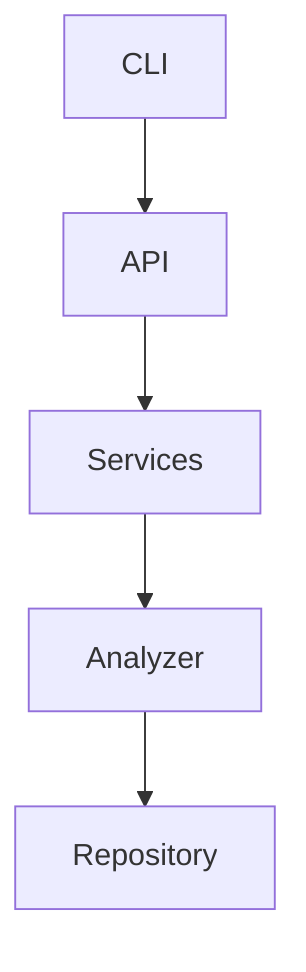

# Architecture Specification

> Generated by spec-gen v1.0.0 on 2026-04-05 10:50

## Purpose

This document describes the architectural patterns and structure of the system.

## Architecture Style

Layered architecture: CLI interface → API layer → service layer → repository pattern over various
data sources. This pattern is chosen for its clear separation of concerns, ease of maintenance, and
scalability.

## Requirements

### Requirement: LayeredArchitecture

The system SHALL maintain separation between:
- CLI (Command-line interface for user interaction and command processing)
- API (API endpoints and command handlers)
- Services (Business logic and orchestration)
- Analyzer (Code analysis and data extraction)
- Repository (Data persistence and retrieval)

#### Scenario: LayerSeparation
- **GIVEN** a request from the presentation layer
- **WHEN** business logic is needed
- **THEN** the presentation layer delegates to the business layer
- **AND** direct database access from presentation is prohibited

### Requirement: SecurityModel

The system SHALL implement security via: API key-based authentication for LLM providers; no user authentication for CLI tool

#### Scenario: AuthenticatedAccess
- **GIVEN** an unauthenticated request
- **WHEN** accessing protected resources
- **THEN** access is denied

## System Diagram

## Layer Structure

### CLI

**Purpose**: Command-line interface for user interaction and command processing
**Location**: `src/cli/commands/mcp.ts, src/cli/commands/view.ts, src/cli/commands/spec-gen.ts`

### API

**Purpose**: API endpoints and command handlers
**Location**: `src/api/run.ts, src/api/generate.ts, src/api/init.ts, src/api/drift.ts`

### Services

**Purpose**: Business logic and orchestration
**Location**: `src/core/services/config-manager.ts, src/core/services/llm-service.ts, src/core/services/chat-tools.ts, src/core/services/mcp-handlers/utils.ts`

### Analyzer

**Purpose**: Code analysis and data extraction
**Location**: `src/core/analyzer/signature-extractor.ts, src/core/analyzer/call-graph.ts, src/core/analyzer/vector-index.ts`

### Repository

**Purpose**: Data persistence and retrieval
**Location**: `src/utils/command-helpers.ts, src/core/services/mcp-handlers/utils.ts`

## Data Flow

CLI command → API endpoint → service → analyzer → repository; results are returned to the user via
CLI output or API responses

## External Integrations

| System | Purpose |
|--------|---------|
| Git | External integration |
| OpenAI-compatible APIs (Gemini, Anthropic, OpenAI, etc.) | External integration |
| LanceDB for vector indexing | External integration |
| tree-sitter for code parsing | External integration |
